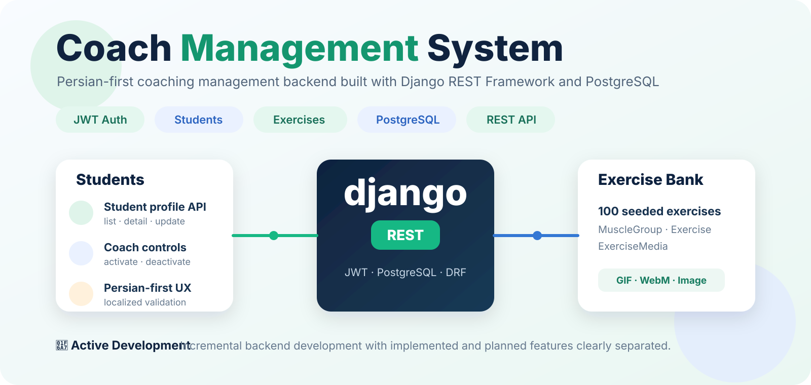
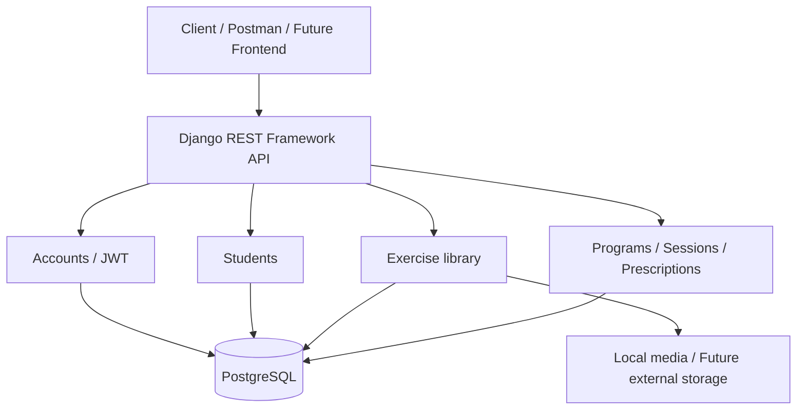
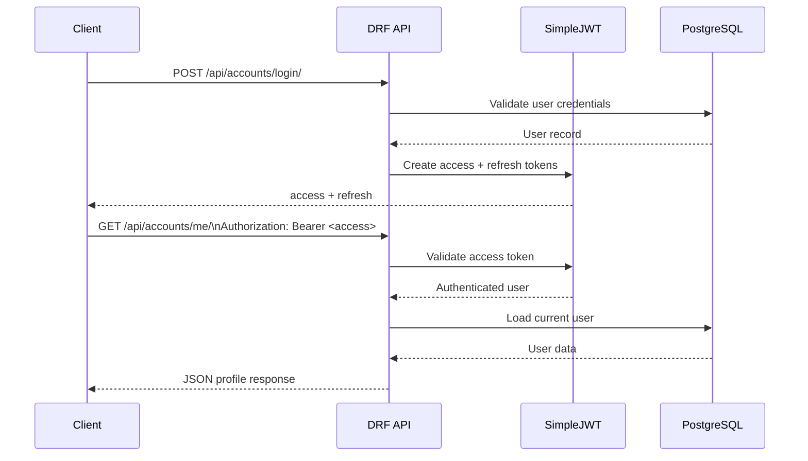

<p align="center">
  
</p>

# Coach Management System

> 🚧 **Active Development** — This project is currently being built incrementally. Implemented features are clearly separated from planned work.

A **Persian-first coaching management platform** built with Django REST Framework and PostgreSQL. The goal is to give coaches one place to manage **online and in-person students**, create **bodybuilding, nutrition, and corrective programs**, and attach **video, GIF, or image guidance** to exercises so students can follow their plans more easily. Authentication, student management, the exercise library, and the core workout-program workflow are implemented in the current code. The project remains unfinished: detailed nutrition planning, payments, notifications, dashboards, automated tests, and production deployment are still planned.

## Tech Stack

`Python 3.11` · `Django 5.2` · `Django REST Framework` · `PostgreSQL` · `SimpleJWT` · `Psycopg 3`

## Current Status

### Implemented
- Custom phone-number-based user model with coach and student roles
- Registration and JWT authentication
- JWT access/refresh flow
- Authenticated current-user profile endpoint
- Student profiles and coach-facing student management APIs
- Exercise bank with muscle groups
- Exercise media model with image, video, GIF, thumbnail, and ordering support
- Coach-facing exercise and muscle-group APIs
- Expandable exercise library with a 100-entry seed dataset for initial development
- Exercise import management command
- PostgreSQL configuration through environment variables
- Secret/config isolation with `.env` support
- Program models and coach APIs for creating, listing, and viewing programs
- Program preparation and publication: `WAITING → PREPARING → ACTIVE`
- Default 45-day duration, publication/expiration timestamps, and expiration checks on program reads
- Workout sessions and exercise prescriptions (sets, reps, rest, weight/intensity, notes, and ordering)
- Soft deletion and restore APIs for programs, sessions, and exercise items
- Student APIs for viewing their own published and expired programs, including sessions, exercises, and instructional media
- Jalali publication and expiration timestamps in program responses

### Remaining work
- Detailed nutrition-plan content (the `NUTRITION` program type exists, but meal planning is not implemented)
- Further validation and completion of bodybuilding/corrective workflows
- Scheduled expiration processing; current expiration checks run when selected program endpoints are read
- Payment management and coach payment notifications
- Inactivity follow-up and notification workflows
- Coach and student dashboards
- Automated regression tests and CI
- Production deployment and external media storage

Implemented here means present in the source code, not that the product is complete or production-ready.
Development requests are checked manually in Postman; automated test coverage is not yet implemented.

## Architecture

The backend follows Django's app-based structure:

```text
morabi/
├── accounts/                 # Users, roles, registration, authentication
├── students/                 # Student profiles and coach-facing student APIs
├── exercises/
│   ├── data/                 # Exercise JSON seed dataset
│   ├── management/commands/  # Exercise import command
│   ├── media_seed/           # Small seed/demo media used by the importer
│   └── ...                   # Models, serializers, views, URLs, migrations
├── programs/                 # Programs, workout sessions, exercise items and student access
├── config/                   # Settings and root URL configuration
├── manage.py
├── requirements.txt
├── .env.example
└── README.md
```

The `programs` app is part of the current backend. Payment and notification modules remain planned.


## Architecture Diagram



Authentication and identity live in `accounts`, student profiles in `students`,
exercise content in `exercises`, and program workflows in `programs`.
PostgreSQL stores application data; uploaded media is kept outside Git.

## API Request Flow



This flow represents the current JWT-protected API behavior: the client authenticates once, receives tokens, and sends the access token in the `Authorization` header for protected endpoints.

## Authentication

Authentication uses **JWT with SimpleJWT**.

Current account routes include:

```text
POST   /api/accounts/register/
POST   /api/accounts/login/
POST   /api/accounts/token/refresh/
GET    /api/accounts/me/
PATCH  /api/accounts/me/
```

Protected endpoints require a bearer token.


## API Examples

The examples below use placeholder data and match the currently implemented serializers and JWT endpoints.

### Register a student

```http
POST /api/accounts/register/
Content-Type: application/json
```

```json
{
  "phone": "09120000000",
  "first_name": "Arman",
  "last_name": "Example",
  "email": "arman@example.com",
  "password": "StrongPassword123!",
  "password_confirm": "StrongPassword123!"
}
```

Example response shape:

```json
{
  "id": 1,
  "phone": "09120000000",
  "first_name": "Arman",
  "last_name": "Example",
  "email": "arman@example.com"
}
```

New self-registered users are created with the student role, and a related student profile is created automatically.

### Obtain JWT tokens

```http
POST /api/accounts/login/
Content-Type: application/json
```

```json
{
  "phone": "09120000000",
  "password": "StrongPassword123!"
}
```

Example response shape:

```json
{
  "refresh": "<refresh-token>",
  "access": "<access-token>"
}
```

### Access the current user

```http
GET /api/accounts/me/
Authorization: Bearer <access-token>
```

Example response shape:

```json
{
  "id": 1,
  "phone": "09120000000",
  "first_name": "Arman",
  "last_name": "Example",
  "email": "arman@example.com",
  "role": "STUDENT",
  "role_display": "شاگرد",
  "created_at": "2026-10-03T12:00:00Z"
}
```

The exact localized value of `role_display` follows the choices configured in the user model.

### Refresh an access token

```http
POST /api/accounts/token/refresh/
Content-Type: application/json
```

```json
{
  "refresh": "<refresh-token>"
}
```

## Manual Testing with Postman

During development, the APIs are tested manually in Postman. This is the current testing
workflow; the project is still under construction and the `tests.py` files do not yet
contain automated regression tests. Manual API checks and automated tests are separate
activities, and passing manual requests does not establish full test coverage.

An exported Postman collection, real response screenshots, and a recorded verification
checklist can be added to the repository later. This README does not claim that every
endpoint or edge case has been verified.

## Student Management

The current backend includes student profile support plus coach-facing student operations for:

- Listing students
- Viewing student details
- Updating student information
- Activating students
- Deactivating students

## Exercise Library

The exercise library is designed to be **expandable**, not limited to the initial seed dataset. Coaches can build on the library over time by adding exercises and attaching instructional media.

The exercise domain currently includes:

- `MuscleGroup`
- `Exercise`
- `ExerciseMedia`

Exercises can include structured information such as muscle groups, difficulty, equipment, common mistakes, and related media.

The repository currently ships with a **100-entry JSON seed dataset** to provide useful starting data for development. This is seed content, not a product limit. The import management command can create or update those records:

```bash
python manage.py import_exercises
```

## Media Handling

Exercise media supports:

- Images
- Video
- GIF
- Optional thumbnails
- Display ordering

The full uploaded media library is **not stored in Git**. Local uploaded media is ignored, while lightweight seed/demo assets required for development may remain in the repository.

Production media storage is planned for a dedicated external storage service rather than the Git repository.

## Program Workflows and Product Vision

The backend is intended for both online and in-person coaching. The current `programs`
app supports these core operations:

- Create a program for a student with a type of `BODYBUILDING`, `CORRECTIVE`, or `NUTRITION`.
- Move a program from `WAITING` to `PREPARING`, then publish it as `ACTIVE`.
- For bodybuilding/corrective programs, create sessions and add exercise prescriptions.
- Before publishing a bodybuilding/corrective program, require at least one non-deleted session with a non-deleted exercise item.
- Set the expiration date at publication using the duration (45 days by default).
- Mark due active programs `EXPIRED` when the expiration service is called by selected read endpoints; no background scheduler is configured yet.
- Soft-delete and restore programs, sessions, and exercise items.
- Let students read their own `ACTIVE` and `EXPIRED` programs; drafts and deleted content are excluded.
- Include exercise descriptions and media in session/exercise responses.

The nutrition type currently identifies a program; it does not yet provide meals,
food items, or a complete nutrition-plan editor. Expired programs provide a basis for
student program history, rather than a separate completed archive product.

### Current program routes

All paths below are relative to `/api/programs/`. Coach routes require authentication
and the coach role; existing-program operations filter by the program creator.
Student routes require the student role and filter by the authenticated student's profile.

| Method | Path | Purpose |
| --- | --- | --- |
| GET | `/` | Coach program list |
| POST | `/create/` | Create a program |
| GET, DELETE | `/<id>/` | Read or soft-delete a program |
| PATCH | `/<id>/start-preparing/` | Begin preparation |
| PATCH | `/<id>/publish/` | Publish and set expiry |
| PATCH | `/<id>/restore/` | Restore a program |
| GET, POST | `/<id>/days/` | List or create sessions |
| GET, PATCH, DELETE | `/<id>/days/<day_id>/` | Read, update, or soft-delete a session |
| PATCH | `/<id>/days/<day_id>/restore/` | Restore a session |
| POST | `/<id>/days/<day_id>/exercises/` | Add an exercise prescription |
| GET, PATCH, DELETE | `/<id>/days/<day_id>/exercises/<item_id>/` | Read, update, or soft-delete an exercise item |
| PATCH | `/<id>/days/<day_id>/exercises/<item_id>/restore/` | Restore an exercise item |
| GET | `/my/` | Student's published/expired programs |
| GET | `/my/<id>/` | Student's program with sessions and exercises |

Payments, follow-up notifications, dashboards, full nutrition planning, and production
media delivery remain future work.

## Local Setup

### 1. Clone the repository

```bash
git clone https://github.com/arman-031/coach-management-system.git
cd coach-management-system
```

### 2. Create a Python 3.11 virtual environment

PowerShell:

```powershell
py -3.11 -m venv .venv
.\.venv\Scripts\Activate.ps1
```

### 3. Install dependencies

```bash
python -m pip install -r requirements.txt
```

### 4. Configure environment variables

Copy:

```text
.env.example
```

to:

```text
.env
```

and replace placeholders with your local values.

Required variables include:

| Variable | Purpose |
| --- | --- |
| `SECRET_KEY` | Django signing key |
| `DEBUG` | Development debug mode |
| `ALLOWED_HOSTS` | Allowed Django hosts |
| `DB_NAME` | PostgreSQL database name |
| `DB_USER` | PostgreSQL username |
| `DB_PASSWORD` | PostgreSQL password |
| `DB_HOST` | PostgreSQL host |
| `DB_PORT` | PostgreSQL port |

### 5. Apply migrations

```bash
python manage.py migrate
```

### 6. Optional: import the exercise dataset

```bash
python manage.py import_exercises
```

### 7. Run the development server

```bash
python manage.py runserver
```

## Development Checks

Useful commands:

```bash
python manage.py check
python manage.py showmigrations
python manage.py test
```

The `tests.py` files currently contain placeholders, so `python manage.py test` does not establish regression coverage. Development testing is performed manually in Postman. Automated tests and CI remain planned; this documentation update does not report a new runtime verification.

## Roadmap

- [x] Django project setup
- [x] PostgreSQL configuration
- [x] Django REST Framework setup
- [x] JWT authentication
- [x] User roles and account endpoints
- [x] Student management API
- [x] Exercise bank models and API
- [x] Exercise import command
- [x] Expandable exercise library foundation with 100-entry seed dataset
- [x] Core program models and APIs
- [x] Default 45-day publication/expiration logic (read-triggered checks)
- [x] Student access to published/expired programs (history foundation)
- [x] Workout sessions and exercise prescriptions
- [x] Program/session/exercise soft deletion and restoration
- [x] Student program detail with exercise media
- [ ] Complete nutrition-plan content
- [ ] Scheduled expiration processing
- [ ] Payment management
- [ ] Notification workflows
- [ ] Coach dashboard
- [ ] Student dashboard
- [ ] Automated tests
- [ ] Production deployment
- [ ] Production media storage

## Security

- `.env` is ignored and must never be committed
- `.env.example` contains placeholders only
- Database credentials are environment-based
- Local databases, virtual environments, uploaded media, editor files, and dumps are excluded from Git
- No stable development signing key is committed
- `DEBUG` defaults to `False` unless explicitly enabled

## Project Goal

This project is being developed as a real-world backend system rather than a one-off tutorial project. Its product goal is to make day-to-day coaching simpler: coaches can manage students, build different kinds of programs, reuse an expandable exercise library, and give students clearer access to exercise instructions whether they train online or in person.

The engineering focus is on progressively implementing authentication, domain modeling, business rules, APIs, program workflows, data imports, media handling, testing, and production-oriented backend practices.
