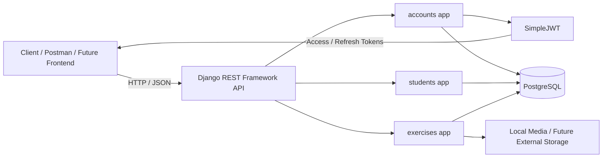
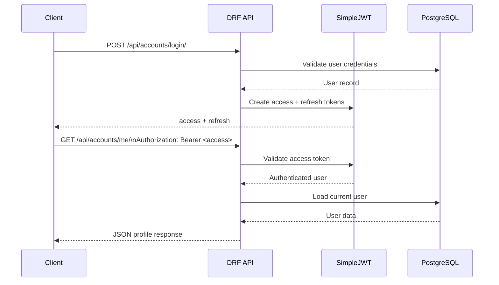

<p align="center">
  
</p>

# Coach Management System

> 🚧 **Active Development** — This project is currently being built incrementally. Implemented features are clearly separated from planned work.

A **Persian-first coaching management platform** built with Django REST Framework and PostgreSQL. The goal is to give coaches one place to manage **online and in-person students**, create **bodybuilding, nutrition, and corrective programs**, and attach **video, GIF, or image guidance** to exercises so students can follow their plans more easily. Authentication, student management, and the exercise library are already implemented; program workflows are the next major development stage.

## Tech Stack

`Python 3.11` · `Django 5.2` · `Django REST Framework` · `PostgreSQL` · `SimpleJWT` · `Psycopg 3`

## Current Status

### Implemented
- Custom phone-number-based user model with coach and student roles
- Registration and JWT authentication
- JWT access/refresh flow
- Authenticated current-user profile endpoint
- Student profiles and coach-facing student management APIs
- Exercise bank with muscle groups
- Exercise media model with image, video, GIF, thumbnail, and ordering support
- Coach-facing exercise and muscle-group APIs
- Expandable exercise library with a 100-entry seed dataset for initial development
- Exercise import management command
- PostgreSQL configuration through environment variables
- Secret/config isolation with `.env` support

### Planned
- Program management
- 45-day program lifecycle rules
- Program archive/history
- Bodybuilding, nutrition, and corrective program workflows
- Payment management
- Coach payment notifications
- Inactivity follow-up flow
- Coach dashboard
- Student dashboard
- Automated test coverage
- Production deployment and external media storage

## Architecture

The backend follows Django's app-based structure:

```text
morabi/
├── accounts/                 # Users, roles, registration, authentication
├── students/                 # Student profiles and coach-facing student APIs
├── exercises/
│   ├── data/                 # Exercise JSON seed dataset
│   ├── management/commands/  # Exercise import command
│   ├── media_seed/           # Small seed/demo media used by the importer
│   └── ...                   # Models, serializers, views, URLs, migrations
├── config/                   # Settings and root URL configuration
├── manage.py
├── requirements.txt
├── .env.example
└── README.md
```

Planned modules such as programs, payments, and notifications are intentionally **not** shown as implemented until they actually exist.


## Architecture Diagram



The current backend is intentionally modular: authentication and identity live in `accounts`, student-specific behavior lives in `students`, and the exercise library lives in `exercises`. PostgreSQL is the persistent data store, while uploaded media is kept outside Git and can later move to production object storage.

## API Request Flow



This flow represents the current JWT-protected API behavior: the client authenticates once, receives tokens, and sends the access token in the `Authorization` header for protected endpoints.

## Authentication

Authentication uses **JWT with SimpleJWT**.

Current account routes include:

```text
POST   /api/accounts/register/
POST   /api/accounts/login/
POST   /api/accounts/token/refresh/
GET    /api/accounts/me/
PATCH  /api/accounts/me/
```

Protected endpoints require a bearer token.


## API Examples

The examples below use placeholder data and match the currently implemented serializers and JWT endpoints.

### Register a student

```http
POST /api/accounts/register/
Content-Type: application/json
```

```json
{
  "phone": "09120000000",
  "first_name": "Arman",
  "last_name": "Example",
  "email": "arman@example.com",
  "password": "StrongPassword123!",
  "password_confirm": "StrongPassword123!"
}
```

Example response shape:

```json
{
  "id": 1,
  "phone": "09120000000",
  "first_name": "Arman",
  "last_name": "Example",
  "email": "arman@example.com"
}
```

New self-registered users are created with the student role, and a related student profile is created automatically.

### Obtain JWT tokens

```http
POST /api/accounts/login/
Content-Type: application/json
```

```json
{
  "phone": "09120000000",
  "password": "StrongPassword123!"
}
```

Example response shape:

```json
{
  "refresh": "<refresh-token>",
  "access": "<access-token>"
}
```

### Access the current user

```http
GET /api/accounts/me/
Authorization: Bearer <access-token>
```

Example response shape:

```json
{
  "id": 1,
  "phone": "09120000000",
  "first_name": "Arman",
  "last_name": "Example",
  "email": "arman@example.com",
  "role": "student",
  "role_display": "Student",
  "created_at": "2026-10-03T12:00:00Z"
}
```

The exact localized value of `role_display` follows the choices configured in the user model.

### Refresh an access token

```http
POST /api/accounts/token/refresh/
Content-Type: application/json
```

```json
{
  "refresh": "<refresh-token>"
}
```

## Postman / API Screenshots

Real Postman screenshots should be captured from the running local API rather than fabricated. The repository is ready for them, and they can be added later under a dedicated documentation/assets folder once representative requests have been captured from the actual project.

## Student Management

The current backend includes student profile support plus coach-facing student operations for:

- Listing students
- Viewing student details
- Updating student information
- Activating students
- Deactivating students

## Exercise Library

The exercise library is designed to be **expandable**, not limited to the initial seed dataset. Coaches can build on the library over time by adding exercises and attaching instructional media.

The exercise domain currently includes:

- `MuscleGroup`
- `Exercise`
- `ExerciseMedia`

Exercises can include structured information such as muscle groups, difficulty, equipment, common mistakes, and related media.

The repository currently ships with a **100-entry JSON seed dataset** to provide useful starting data for development. This is seed content, not a product limit. The import management command can create or update those records:

```bash
python manage.py import_exercises
```

## Media Handling

Exercise media supports:

- Images
- Video
- GIF
- Optional thumbnails
- Display ordering

The full uploaded media library is **not stored in Git**. Local uploaded media is ignored, while lightweight seed/demo assets required for development may remain in the repository.

Production media storage is planned for a dedicated external storage service rather than the Git repository.

## Product Vision & Business Rules

The system is being built to support both **online coaching** and **in-person coaching** from the same backend. A coach should be able to open a student's page, create the appropriate program, attach relevant exercise guidance, and keep previous programs accessible to the student.

The following program workflows and business rules are planned and are **not yet fully implemented**:

- Program categories:
  - **Bodybuilding**
  - **Nutrition**
  - **Corrective**
- Program duration: **45 days**
- Students retain previous programs in an archive
- Exercise items can provide **video, GIF, or image guidance** for easier movement access
- The exercise library remains expandable as the coach adds new movements
- Coaches receive payment-related notifications
- Coaches can review inactive students and decide whether to send follow-up notifications

## Local Setup

### 1. Clone the repository

```bash
git clone https://github.com/arman-031/coach-management-system.git
cd coach-management-system
```

### 2. Create a Python 3.11 virtual environment

PowerShell:

```powershell
py -3.11 -m venv .venv
.\.venv\Scripts\Activate.ps1
```

### 3. Install dependencies

```bash
python -m pip install -r requirements.txt
```

### 4. Configure environment variables

Copy:

```text
.env.example
```

to:

```text
.env
```

and replace placeholders with your local values.

Required variables include:

| Variable | Purpose |
| --- | --- |
| `SECRET_KEY` | Django signing key |
| `DEBUG` | Development debug mode |
| `ALLOWED_HOSTS` | Allowed Django hosts |
| `DB_NAME` | PostgreSQL database name |
| `DB_USER` | PostgreSQL username |
| `DB_PASSWORD` | PostgreSQL password |
| `DB_HOST` | PostgreSQL host |
| `DB_PORT` | PostgreSQL port |

### 5. Apply migrations

```bash
python manage.py migrate
```

### 6. Optional: import the exercise dataset

```bash
python manage.py import_exercises
```

### 7. Run the development server

```bash
python manage.py runserver
```

## Development Checks

Useful commands:

```bash
python manage.py check
python manage.py showmigrations
python manage.py test
```

At the current project stage, Django's test command runs successfully but the repository does not yet contain meaningful automated test coverage.

## Roadmap

- [x] Django project setup
- [x] PostgreSQL configuration
- [x] Django REST Framework setup
- [x] JWT authentication
- [x] User roles and account endpoints
- [x] Student management API
- [x] Exercise bank models and API
- [x] Exercise import command
- [x] Expandable exercise library foundation with 100-entry seed dataset
- [ ] Program models and APIs
- [ ] 45-day program lifecycle
- [ ] Program archive/history
- [ ] Payment management
- [ ] Notification workflows
- [ ] Coach dashboard
- [ ] Student dashboard
- [ ] Automated tests
- [ ] Production deployment
- [ ] Production media storage

## Security

- `.env` is ignored and must never be committed
- `.env.example` contains placeholders only
- Database credentials are environment-based
- Local databases, virtual environments, uploaded media, editor files, and dumps are excluded from Git
- No stable development signing key is committed
- `DEBUG` defaults to `False` unless explicitly enabled

## Project Goal

This project is being developed as a real-world backend system rather than a one-off tutorial project. Its product goal is to make day-to-day coaching simpler: coaches can manage students, build different kinds of programs, reuse an expandable exercise library, and give students clearer access to exercise instructions whether they train online or in person.

The engineering focus is on progressively implementing authentication, domain modeling, business rules, APIs, program workflows, data imports, media handling, testing, and production-oriented backend practices.
